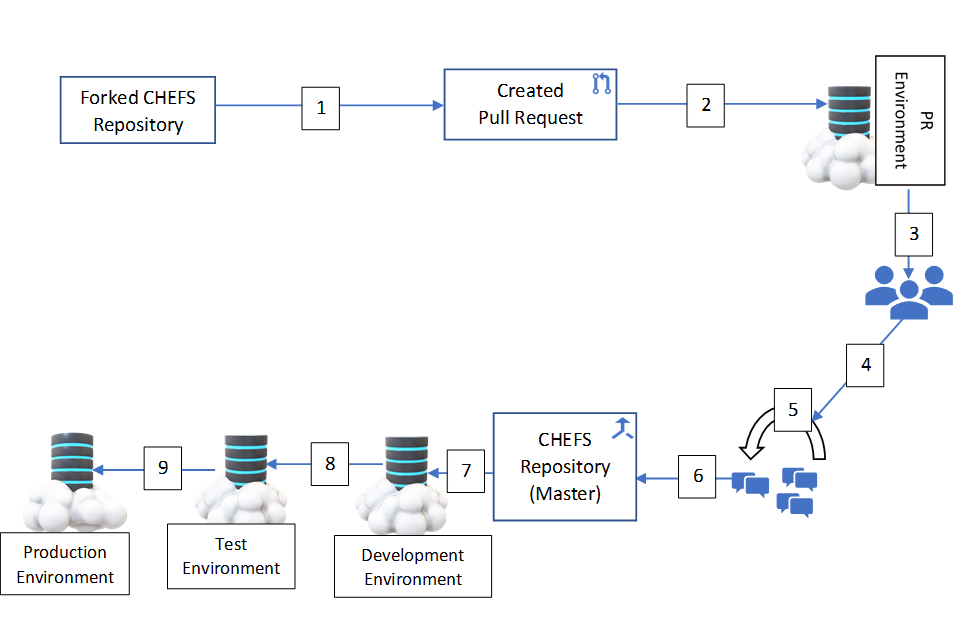

[Home](index) > [Developer](Developer) > [Contributors](Contributors) > **Git Branching and Pull Request Workflow**
***

<!--  -->

## Creating and Merging Pull Requests from partners

* Create a PR from the forked CHEFS Repository to the CHEFS master branch. Check out a more detailed guide on creating from a forked repository https://docs.github.com/en/pull-requests/collaborating-with-pull-requests/proposing-changes-to-your-work-with-pull-requests/creating-a-pull-request-from-a-fork0

* The PR will be automatically deployed to PR Environment in the Openshift and will start test automation. Note: the forminators team will not review the code until the automated test is passed.

* Request code review from the partners. Access will be given to UI/UX designers, product owners, and other stakeholders to review the change
Two scenarios can make the forminators team lead to reverting the changes:

If designers are not satisfied with the UI and want improvements to be implemented by the partner developers

If the forminators team product owner declines the change. It is believed there would have been high-level conversations between the product owners which should make this scenario happen less often

* Once the change is approved by the product owner and UI/UX designers, the forminators team developers will begin technical review.

* The code review process will continue until the PR

is approved after all requirements are satisfied.

is declined if the reviewers think the work is not ready for a pull request

* If the PR is approved, it will be merged into the master branch of the CHEFS Repository

* The change will automatically deploy to the dev environment after merging the PR to the master branch.

* Once approved, the forminators team lead will deploy the change to the test environment, where further smoke or sanity checks will be done.

* Once the feature is ready for production, the forminators team lead will deploy it to the production environment.

***
[Terms of Use](Terms-of-Use) | [Privacy](Privacy) | [Security](Security) | [Service Agreement](Service-Agreement) | [Accessibility](Accessibility)